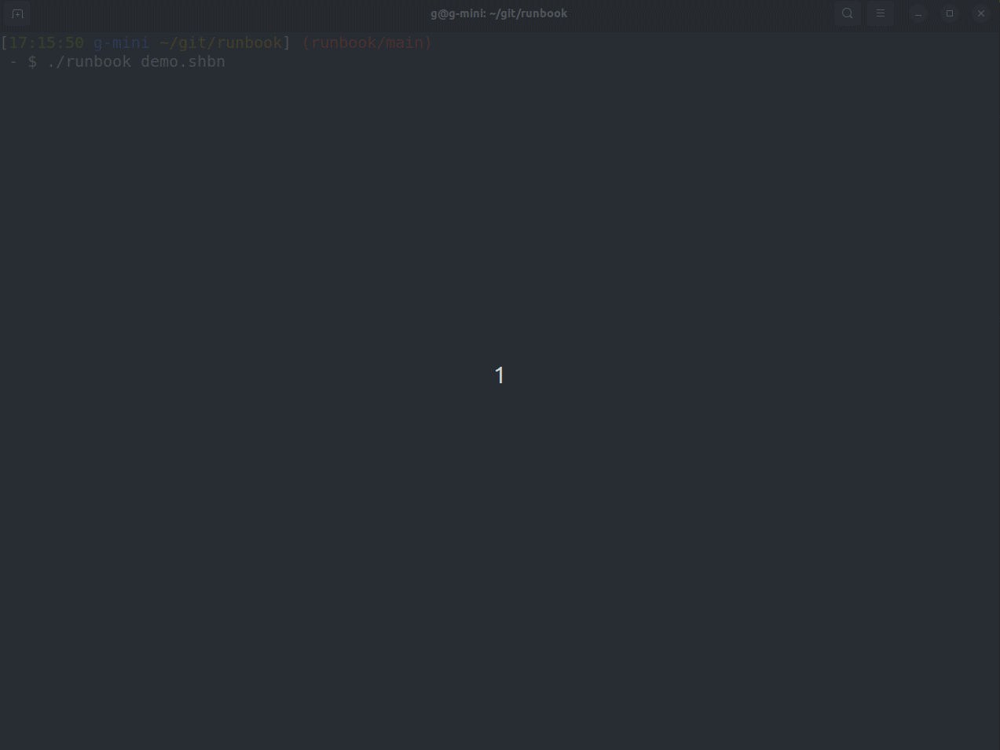

# runbook

A terminal UI for running shell commands in context.

The idea is to provide a modern and intuitive way to run and manage shell commands that you frequently execute. 
It is especially useful for system administrators, developers, and anyone who spends a lot of time in the terminal.

## getting started

```bash
./runbook <file_name>.shbn
```



Make a runbook from markdown file

```bash
./runbook --from-md <file_name>.md > <notebook_name>.shbn
```

Convert runbook to markdown file

```bash
./runbook --to-md <file_name>.shbn > <notebook_name>.md
```

Make a shell script from runbook

```bash
./runbook --to-sh <file_name>.shbn > <script_name>.sh
```

## development

```bash
make build
make test
```

## shbn file format

shbn files follow the same format as Jupyter Notebook. See the official [Jupyter Notebook format](https://github.com/jupyter/nbformat) defined with this JSON schema.
